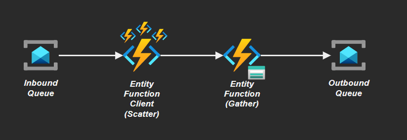

# Azure Durable Function



Requirements:

- [Azure Functions Core Tools SDK](https://github.com/Azure/azure-functions-core-tools)
- [Azure Azurite](https://github.com/Azure/Azurite)
- Service Bus namespace
- Node 16+

## Setup

Ramp up a Service Bus instance:

```sh
# Create the thing
az group create -n "rg-local-dev" -l "eastus2"
az servicebus namespace create -n "bus-az-durable-functions-dev" -g "rg-local-dev" -l "eastus2" --sku "Basic"
az servicebus queue create -n "inbound" --namespace-name "bus-az-durable-functions-dev" -g "rg-local-dev" --enable-partitioning
az servicebus queue create -n "outbound" --namespace-name "bus-az-durable-functions-dev" -g "rg-local-dev" --enable-partitioning

# Export for the function
export AZURE_SERVICEBUS_CONNECTION_STRING=$(az servicebus namespace authorization-rule keys list -g "rg-local-dev" --namespace-name "bus-az-durable-functions-dev" --name "RootManageSharedAccessKey" --query "primaryConnectionString" -o tsv)
```

> 💡 To quick start Service Bus local testing use my [Postman collection boilerplate](https://github.com/epomatti/servicebus-postman-collection)

Start Azurite:

```sh
azurite -s -l /tmp/azurite
```

Create `local.settings.json` with the following content:

```json
{
  "IsEncrypted": false,
  "Values": {
    "FUNCTIONS_WORKER_RUNTIME": "node",
    "AzureWebJobsStorage": "UseDevelopmentStorage=true",
    "QueueConnectionString": "AccountName=devstoreaccount1;AccountKey=<<<ACCOUNT_KEY>>>;DefaultEndpointsProtocol=http;BlobEndpoint=http://127.0.0.1:10000/devstoreaccount1;QueueEndpoint=http://127.0.0.1:10001/devstoreaccount1;TableEndpoint=http://127.0.0.1:10002/devstoreaccount1;"
  }
}
```

Replace the account key with your emulator key (use Storage Explorer to the Key).

Start the function app:

```sh
func start
```

Testing the app by sending messages to the queue.

## Reference

- [Durable Functions .NET Entities](https://learn.microsoft.com/en-us/azure/azure-functions/durable/durable-functions-dotnet-entities)
- [Aggregator (Scatter-Gather)](https://learn.microsoft.com/en-us/azure/azure-functions/durable/durable-functions-overview?tabs=javascript#aggregator)
- [Stateful Entities](https://learn.microsoft.com/en-us/azure/azure-functions/durable/durable-functions-entities?tabs=csharp)
- [Fan-out/fan-in scenario in Durable Functions](https://learn.microsoft.com/en-us/azure/azure-functions/durable/durable-functions-cloud-backup?tabs=javascript)
- [Singleton orchestrators in Durable Functions](https://learn.microsoft.com/en-us/azure/azure-functions/durable/durable-functions-singletons?tabs=javascript)
- [Functions built-in hooks](https://pjlee.net/blog/how-to-trigger-and-query-an-azure-entity-function-without-using-an-ordinary-function-just-use-the-bu)
